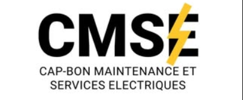

# CMSE Vitrine - Industrial Showcase



## 🚀 Built with Antigravity
This entire production-grade application was completely architected, designed, and deployed from scratch in **under 1 hour** using [Antigravity], the advanced agentic AI coding assistant. Antigravity handled the complete UI/UX design, trilingual routing, responsive component architecture, and CI/CD deployment logic autonomously.

---

## 📖 Project Overview
The **CMSE Vitrine** is a high-performance, strictly dark-mode showcase website for **Cap-Bon Maintenance et Services Électriques (CMSE)**. 

CMSE is a leading Tunisian industrial firm specializing in the sale, installation, and maintenance of heavy-duty diesel generators. They are also the official legal representative and distributor for **Deep Sea Electronics (DSE)** in North Africa.

This application acts as a high-conversion lead generation platform, allowing the company to showcase its authority and instantly capture inbound emergency requests.

## ✨ Core Features
- **🌐 Trilingual Architecture**: Native, zero-reload switching between English, French, and Arabic. The interface automatically adapts to strict RTL (Right-to-Left) layouts when Arabic is selected.
- **⚡ Emergency Infrastructure**: Embedded click-to-call APIs prominently placed in the Navbar and Footer to instantly dial the company's emergency hotline on mobile devices.
- **🛡️ Authority Components**: Features a dynamic Statistics Bar, Interactive FAQ Accordion, and a "Partners" section displaying the official Deep Sea Electronics badge.
- **📧 Serverless Contact Form**: Built-in AJAX contact form using formsubmit.co, perfectly routing client inquiries to the company inbox without needing a backend SQL database.
- **🛠️ Industrial Aesthetic**: A fully custom Caterpillar-inspired (Black/Yellow/Grey) design system enforced globally via vanilla CSS to reflect heavy industry strength and reliability.

## 💻 Technology Stack
- **Framework**: React 19 + Vite
- **Localization**: `i18next` & `react-i18next`
- **Iconography**: `lucide-react` & `react-icons`
- **Styling**: Vanilla CSS (Global Variables, Flexbox, CSS Grid)
- **Deployment**: Configured for edge-network hosting (Vercel / GitHub Pages)

## 🏎️ Running Locally

First, clone the repository and install the dependencies:
```bash
npm install
```

Then, launch the Vite development server:
```bash
npm run dev
```

## 🚀 Deployment

The project is natively configured for automated GitHub Pages static deployment.

To deploy the latest changes:
```bash
npm run build
npm run deploy
```
*(Ensure to configure `vite.config.js` with your repository base path before deploying to a sub-directory.)*

---
*Developed autonomously via Antigravity AI session.*
